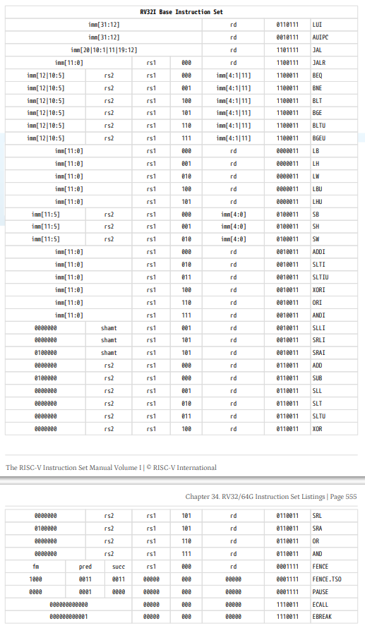

| Лабораторная работа №3   | M3104                       | АОВС |
|--------------------------|-----------------------------|------|
| Кэш и кодирование команд | Бигулов Александр Артурович | 2024 |

## Инструментарий

Компилятор языка C++, стандарт C++20 (MSVC на Windows, GNU GCC и CLang на Linux).

## Что реализовано

Вариант 2, реализованы все задания: рассчитаны параметры, данный код переведен в ассемблер RISC-V, реализован расчета
количества попаданий в кэш для политик LRU и bit-pLRU, а также перевод ассемблерных файлов в машинный код.

## Результат работы на тестовых данных: [ссылка на последний успешный action с актуальными данными](https://github.com/skkv-itmo-comp-arch/se-comp-arch24-cache-isa-bialger/actions/runs/9078022501)

# Описание:

Программа состоит из трех подсистем - `argparser`, `asm_riscv`, `cache` и главной подпрограммы, которая отвечает за
применение средств из этих подсистем для выполнения задачи.

## Подсистема argparser

Данный модуль содержит набор связанных классов, предоставляющих функционал обработки пользовательского ввода -
аргументов командной строки, которые определяют поведение программы.
Основной его класс - [ArgParser](./libraries/argparser/ArgParser.hpp).
Более подробно подсистема описана [в разделе документации подсистемы](./libraries/argparser/docs/README.md).
Особенно подробно описана [архитектура подсистемы](./libraries/argparser/docs/dev/architecture.md) и пользовательская
[документация основного класса](./libraries/argparser/docs/ArgParser.md).
Содержит вложенный модуль `argparser_basic`, который содержит некоторый набор вспомогательных функций, например,
вывода ошибок красным цветом.

## Подсистема asm_riscv

Данный модуль содержит набор классов и связей между ними, предоставляющий функционал для псевдо-эмуляции исполнения
ограниченного набора команд RISC-V (RV32I, RV32M, без Zifence, Zicsr, `FENCE`, `FENCE.TSO` и `PAUSE` инструкций).
Для этого эмулируются регистры процессора, псевдо-память процессора и исполнитель команд.
Псевдо-эмуляция это потому что, вместо исполнения хранимого в памяти байт-кода непосредственно, происходит
последовательные вызовы функций от объектов, хранящих некие нормированные переданные аргументы, а также имя инструкции.

Из связанного с этой подсистемой: файл [rv32.asm](./rv32.asm) - перевод данной функции в ассемблер RISC-V.
Был выполнен вручную, в частности, с расчетами прыжковых инструкций и инструкций условного перехода.
Подробнее про него можно прочитать в комментариях к ассемблерному коду - они достаточно обширны.
Я узнал, как записываются и что делают большинство инструкций вышеупомянутого подмножества RISC-V.

Результат перевода этого ассемблерного файла в байт-код - в файле [rv32.bin](rv32.bin).

Перевод ассемблерного кода в байт-код описано в файле [RISCVAssemblerToBinary](./libraries/asm-riscv/RISCVAssemblerToBinary.cpp). 
Этот класс переводит набор объектов-команд класса `RISCVAssemblerCommand`, полученных с помощью `RISCVAssemblerReader`, 
в набор их байт-кодов.
Главная подпрограмма, если был указан соответствующий аргумент, записывает эти коды последовательно эти коды в файл в 
порядке Little Endian.

### ProcessMemory

Данный класс предоставляет интерфейс взаимодействия с квази-оперативной памятью.
Он имеет поле, содержащее в себе оперативную память псевдо-эмулятора - `std::vector<uint8_t>`, каждый элемент которой -
отдельный байт, а также два поля, объекты, эмулирующие кеш для расчета процента попаданий двух разных политик.

#### Методы ReadByte, ReadHalfWord, ReadWord

Эти методы нужны для чтения, соответственно, 1- 2- и 4-байтовых беззнаковых чисел из массива памяти по переданному
адресу в порядке LittleEndian - младшие байты правее.
Выполняются с помощью метода Read - получаемый оттуда `std::vector<uint8_t>` соответственной размерности.
Например, для числа `0x12345678` это будет `{0x78, 0x56, 0x34, 0x12}`.
Также вызывает одноименные функции обоих кешей.

#### Методы WriteByte, WriteHalfWord, WriteWord

Эти методы нужны для записи, соответственно, 1- 2- и 4-байтовых беззнаковых чисел из массива памяти по переданному
адресу в порядке LittleEndian - младшие байты правее.
Выполняются с помощью метода Write - туда передается `std::vector<uint8_t>` соответственной размерности.
Также вызывает одноименные функции обоих кешей.

#### Метод Read

Данный метод возвращает `std::vector<uint8_t>`, длина которого обусловлена одноименным параметром, а содержит он копию
отрезка массива памяти, начиная с переданного адреса.

#### Метод Write

Данный метод принимает `std::vector<uint8_t>`, который копируется в массив памяти, начиная с переданного адреса.

#### Методы GetLRUHitRate, GetBitpLRUHitRate

Эти методы возвращают результат выполнения метода GetHitRate от кешей с соответствующими политиками.

### RISCVRegisters

Этот класс является представлением регистров 32-битного процессора, а также регистра PC - Program Counter, который
при настоящей эмуляции хранил бы адрес текущей инструкции, но используется для перехода по массиву инструкций.
Содержит методы для их получения и изменения в определенных пределах.
Например, нельзя изменить регистр `x0` - это всегда 0.

#### Метод GetRegister

Данный метод принимает номер регистра, возвращает его значение, как 32-битное знаковое число.

#### Метод SetRegister

Данный метод принимает номер регистра и его новое значение, заменяет старое значение, если регистр не `x0`.

#### Метод GetPC

Данный метод возвращает значение ProgramCounter, как 32-битное беззнаковое число.

#### Метод SetPC

Данный метод настраивает переданное значение как ProgramCounter.

### RISCVAssemblerCommand

Данный класс ответственен за хранение инструкции (функтора) с аргументами.
Получая в конструктор имя команды и ее аргументы, в конструкторе он выбирает соответствующий команде функтор.
К примеру, если имя команды - `"add"`, то функтор сложит значения второго и третьего (то есть, формально из регистра
под номером значения) регистров, а затем положит результат в первый и вернет `0`.
Все команды возвращают коды возврата, например, `ecall` вернет `1`, а `jalr` в `0` (то есть в начало программы) - `-1`.

Аргументы от одного до трех (при необходимости третий хранится как значение) регистров или от нуля до двух значений.
Номера регистров хранятся как беззнаковое 8-битное число, а значение - как знаковое 32-битное.
Имеет метод выполнения команды, который не меняет объект, но может менять передаваемые по ссылке регистры и память.

#### Метод Execute

Данный метод получает по ссылке регистры и память, и выполняет функтор от них и хранимых аргументов.

#### Методы GetCommandName, GetReg1, GetReg2, GetValue

Методы для получения информации о команде. Возвращают всю перечисленную информацию соответствующего типа.

#### Методы SignExtended12Bits и прочие подобные

Эти методы приводят переданное число к указанному в названии виде, причем в случае sign, расширение проходит с
сохранением знака (заполнением старших бит единицами), а в unsigned - просто заполнением старших разрядов нулями.
12-битные обрезаются (путем сдвига вправо, а затем влево на 20 бит) до первых 12 бит, а 20-битные - сдвигаются влево
так, чтобы старший их них стал 32-м.
SignExtended13Bits работает аналогично SignExtended12Bits, но сдвигает сначала влево на 19, потом вправо на 20, и затем
влево на 1, таким образом оставляя байты со второго по 13-й.

### RISCVAssemblerReader

Класс, который приводит переданные ему строки в Base Form (все маленькими буквами), регистры имеют исключительно
значения `x0-x31`, нет комментариев и пустых строк и затем создает из них ассемблерные команды.

#### Метод PreProcessLine

Данный метод предварительно обрабатывает по ссылке _линию_ - `std::vector<std::string>`, каждая из которых ранее была
разделена пробелом.
Он с помощью `std::transform` сначала приводит все элементы линии в нижний регистр.
Затем он поиском по каждому элементу убирает запятые, после этого - преобразовывает записи вида `val(reg)` в `val` и
`reg`.
После этого все ABI-имена регистров преобразуются в базовую форму (`x0-x31`).

#### Метод PreProcess

Данный предварительно обрабатывает набор _линий_ из всех инструкций. Сначала удаляются все комментарии - в каждой
_линии_ все слова, начиная с `"//"`, если таковое есть, после чего удаляются пустые _линии_ и для каждой _линии_
вызывается метод PreProcessLine.

#### Метод ProcessLine

Данный метод создает из _линии_ объект `RISCVAssemblerCommand`.
Первое _слово_ строки становится кодом команды.

* Если команда без аргументов, то регистры и значение устанавливается в `0`, первое _слово_ строки становится кодом
  команды.
* Если команда имеет один аргумент, то, если первый символ второго _слова_ - `x`, то переведенная `std::stoi` в число
  оставшаяся часть _слова_ становится значением первого регистра, иначе - переведенное целое _слово_ в число с помощью
  `GetInteger` становится значением.
* Если команда имеет два аргумента, то первый из них по указанной выше методике становится первым регистром, а второй -
  в зависимости от того, первых символ `x` или нет, по там же указанной методике становится вторым регистром или
  значением.
* Если команда имеет три аргумента, то первый из них по указанной выше методике становится первым регистром, а далее:
    * Если второй аргумент начинается с `x`, то по указанной выше методике он становится вторым регистром, а третий
      аргумент, в зависимости от того, первых символ `x` или нет, по там же указанной методике становится третьим
      регистром или значением.
    * Если второй аргумент не начинается с `x`, то по указанной выше методике он становится значением, а третий
      аргумент, по там же указанной методике становится третьим регистром.

#### Метод Process

Данный метод обрабатывает набор _линий_, описывающий ассемблерные команды, и переводит их в
`std::vector<RISCVAssemblerCommand>`. Сначала он вызывает метод `PreProcess`, а затем для каждой линии вызывает метод
`ProcessLine`, сохраняя результат.

#### Метод GetCommands

Данный метод возвращает `std::vector<RISCVAssemblerCommand>`, в котором после вызова `Process` лежит упорядоченный набор
команд.

#### Метод GetInteger

Данный метод переводит строку в число, используя `std::strtoll` с обработкой `C-style` ошибок.

### Класс RISCVCommandExecutor

Данный класс ответственен за выполнение набора последовательных инструкций из вышеупомянутого подмножества RISC-V,
переданных в виде `std::vector<RISCVAssemblerCommand>`.
Память процесса псевдо-эмулируется классом `ProcessMemory`, регистры (включая Program Counter) - `RISCVRegisters`.

#### Метод Execute

Данный метод производит псевдо-эмуляцию переданных ранее инструкций.
Значение `PC` - Program Counter - это адрес начала 4-байтового (для вышеуказанного подмножества) байт-кода инструкции,
поэтому считается, что `index = PC / 4`, где `index` - индекс в векторе команд.
Таким образом, в цикле для `index` от `index = PC / 4` (в начале симуляции `PC = index = 0`), пока `index` не превысит
размер вектора команд, после каждой итерации `index = PC / 4`, происходит следующее:

* Запоминается значение `PC`
* Выполняется инструкция по индексу `index`
* Происходит обработка кодов возврата:
  * Если код возврата - `-1`, это значит, что инструкция `jalr` перевела `PC` в `0`, что почти всегда означает 
    бесконечный цикл, учитывая специфику инструкции, происходит выход из функции
  * Если код возврата - `1`, это значит, что была исполнена инструкция `ecall`. Выбрасывается исключение 
    `std::runtime_error` с соответствующим сообщением.
  * Если код возврата - `2`, это значит, что была исполнена инструкция `break`. Выбрасывается исключение
    `std::runtime_error` с соответствующим сообщением.

В конце тела цикла, если `PC` не был изменен в инструкции, `PC` увеличивается на 4.
После выхода из цикла, если `PC` не равен учетверенному размеру вектора команд, выбрасывается исключение 
`std::runtime_error` с соответствующим сообщением, поскольку это означает некорректное перемещение `PC`.

### Класс RISCVAssemblerToBinary

Данный класс ответственен за перевод набора команд в набор бинарных кодов для них. Содержит статические методы, 
необходимые для этого.

#### Метод ToBinary

Данный метод переводит одну команду, переданную как ссылка на `RISCVAssemblerCommand`, в байт-код в виде беззнакового 
32-битного числа.
Для этого из команды берется ее имя, значения регистров и значение, к ним применяются всевозможные битовые маски 
(например, создается переменная, хранящая младшие 5 бит значения для кодирования величины сдвига).
Затем, согласно имени команды, результат конструируется с помощью битовых масок и побитовых операций согласно таблицам:



Обычно первый регистр соответствует `rd`, второй - `rs1`, третий - `rs2`. 
Если в команде нет `rd`, то первый - `rs1`, второй - `rs2` (кроме `s*` команд - там обратный порядок).

## Подсистема cache

Данная подсистема ответственна за псевдо-эмуляцию кеша процессора с целью получения статистики кеш-попаданий - какая 
доля запросов в кеш была успешна, то есть запрашиваемые данные там уже были.

Расчет [параметров системы](./libraries/cache/constants.hpp) был проведен следующим образом.
Известно:

```cpp
constexpr size_t MEM_SIZE = 524288;
constexpr size_t CACHE_INDEX_LEN = 4;
constexpr size_t CACHE_OFFSET_LEN = 5;
constexpr size_t CACHE_SIZE = 2048;
```

Заметим, что `MEM_SIZE = 2 ^ ADDR_LEN`. Значит, длина адреса `ADDR_LEN = log2(MEM_SIZE) = 19`.
Также размер кеш-линии `CACHE_LINE_SIZE = 2 ^ CACHE_OFFSET_LEN = 32`.
Кроме того, количество кеш-линий `CACHE_LINE_COUNT = CACHE_SIZE / CACHE_LINE_SIZE = 64`.
Далее, количество элементов в кеш-линии `CACHE_WAY = CACHE_LINE_COUNT / (2 ^ CACHE_INDEX_LEN) = 4`.
Наконец, длина тега `CACHE_TAG_LEN = ADDR_LEN - CACHE_INDEX_LEN - CACHE_OFFSET_LEN = 10`.

### Класс Cache

Данный класс ответственен за симуляцию поведения кеша - он подсчитывает попадания в кеш и запросы, и имеет методы 
возврата статистики.
Содержит объект политики, набор кеш-тегов и числа статистики.

#### Методы ReadByte и т.п.

Данные методы вызывают метод `Read` с соответствующим размеров в байтах, передавая туда еще адрес. Ничего не возвращают -
нужны для сбора статистики.

#### Методы WriteByte и т.п.

Данные методы вызывают метод `Write` с соответствующим размеров в байтах, передавая туда еще адрес. Ничего более не 
принимают - нужны для сбора статистики.

#### Метод GetHitRate

Возвращает отношение количества попаданий к количеству запросов.

#### Метод HandleRequest

Данный метод нужен для обработки запроса и выяснения, произошло попадание или нет, и вызова соответствующих обновления 
политик.
Сначала ищет индекс тега в наборе тегов для текущей кеш-линии (метод поиска - полный перебор, описан в 
[common_functions.hpp](./libraries/cache/common_functions.hpp)).
Если тег был не найден, то вызывается метод добавления тега от политики `AddLine`.
Если был, то количество попаданий инкрементируется и вызывается метод обновления политики `UpdatePolicy`.

#### Метод Read

Данный метод ответственнее за инициацию проверки на наличие в кеше информации по данному адресу при чтении.
Сначала адрес обрезается до `ADDR_LEN` битов, после чего вычисляется номер кеш-линии и тег.
Тег получается сдвигом на `CACHE_INDEX_LEN + CACHE_OFFSET_LEN`, давая длину тега `CACHE_TAG_LEN`.
Индекс - сдвигом на длину оффсета `CACHE_OFFSET_LEN` и оставлением младших `CACHE_INDEX_LEN` битов.
Запускает от этих параметров `HandleRequest`.

#### Метод Write

Данный метод ответственнее за инициацию проверки на наличие в кеше информации по данному адресу при записи.
Сначала адрес обрезается до `ADDR_LEN` битов, после чего вычисляется номер кеш-линии и тег.
Тег получается сдвигом на `CACHE_INDEX_LEN + CACHE_OFFSET_LEN`, давая длину тега `CACHE_TAG_LEN`.
Индекс - сдвигом на длину оффсета `CACHE_OFFSET_LEN` и оставлением младших `CACHE_INDEX_LEN` битов.
Запускает от этих параметров `HandleRequest`.

### Класс LRUPolicy

Данный класс описывает политику вытеснения `LRU`. 
В ней из кеша вытесняются наиболее давно использовавшиеся теги.
Реализовано это так: чем выше индекс тега в линии, тем позднее он был использован.

#### Метод UpdatePolicy

Метод, обновляющий таймер. Удаляет тег в линии, куда попал запрос, с его текущего места, и помещает в 
конец линии.

#### Метод AddLine

Метод, добавляющий новый тег. Удаляет самый старый тег в линии, если ее размер равен максимальному, и добавляет в конец 
переданный тег.

## Результат работы

Статистика (вывод) для `lab3.exe --replacement 0 --asm ./rv32.asm --bin ./rv32.bin`:

```text
LRU     hit rate: 96.6571%
pLRU    hit rate: 96.6406%
```

Файл [rv32.bin](./rv32.bin):

```bin
93 0E 00 04 13 0F C0 03 93 0F 00 02 93 04 00 10 37 19 00 00 13 09 F9 7F 13 09 19 00 B3 02 00 00 63 D2 D2 09 33 03 00 00 63 50 E3 07 93 09 F0 7F 93 89 19 10 33 0A 00 00 B3 03 00 00 63 D8 F3 03 B3 8C 74 00 03 8B 0C 00 33 8D 69 00 33 0D 6D 00 83 1B 0D 00 33 0E 7B 03 33 0A CA 01 B3 89 E9 01 B3 89 E9 01 93 83 13 00 6F F0 51 FD B3 0D 69 00 B3 8D 6D 00 B3 8D 6D 00 B3 8D 6D 00 23 A0 4D 01 13 03 13 00 6F F0 51 FA B3 84 F4 01 33 09 E9 01 33 09 E9 01 33 09 E9 01 33 09 E9 01 93 82 12 00 6F F0 11 F8 67 80 00 00
```

> Раздел, в котором вы описываете свою реализацию:
> Cache:
> - какие классы/функции созданы для представления кеша, как реализованы политики вытеснения и конфигурация в целом, как
    он работает
>> Представьте, что вы пришли на защиту, и вам сказали "Рассказывай, что как реализовано".

