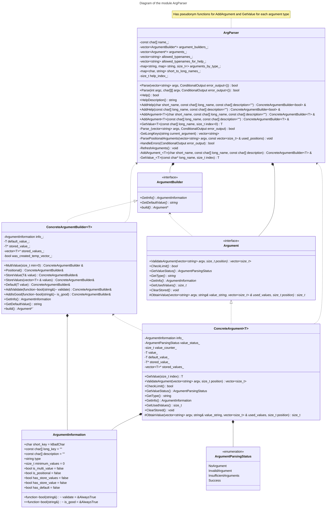

# Архитектура продукта

В этом документе описывается архитектура продукта - парсера аргументов командной 
строки, разработанная на основании [требований](requirements.md).

## Системная архитектура

* Продукт не имеет системной архитектуры, поскольку его предполагается использовать 
  в качестве подсистемы, встраиваемой в иные продукты.

#### UML-диаграмма

## Архитектура подсистем

* Исходя из вышеуказанного предполагаемого использования продукта, весь продукт 
  представляет собой одну подсистему - библиотеку argparer, которая должна обрабатывать
  данные аргументы командной строки.

### Архитектура подсистемы "ArgParser"

#### UML-диаграмма

Эта подсистема представляет собой набор классов и связей между ними, которые выполняют
непосредственно парсинг аргументов командной строки, передаваемых в подсистему. Все
классы находятся в пространстве имён ArgumentParser.

#### Класс ArgParser

Этот класс является основным классом модуля, именно с ним обычно взаимодействует 
пользователь. Он должен предоставлять следующие возможности: добавление обрабатываемого
аргумента (любого из указанных) с указанным ключом, парсинг набора аргументов командной
строки, а также функция добавления аргумента. Кроме того, должен иметь функцию 
составления справки и обрабатывать ошибки в синтаксисе аргументов командной строки,
и, в некоторых случаях, выводить их.

#### Класс ArgumentBuilder

Этот класс реализует паттерн проектирования "Builder": ссылки на объекты наследников 
этого класса должна возвращать функция добавления аргумента из ArgParser, к нему 
должен обращаться пользователь, добавляя информацию об аргументе. Должен 
реализовывать функции добавления любой информации про аргумент, представленные в 
[тестах](../../../../tests/argparser_unit_tests.cpp) и функцию построения. Ему должен 
наследовать шаблонизированный класс конкретного Builder, который будет реализовывать 
вышеуказанный функционал для каждого из типов аргумента.

#### Класс Argument

Этот класс является родительским классом для всех классов аргументов. Должен иметь
функции возврата статуса парсинга и возврата информации об аргументе, а также функцию 
получения значения аргумента из аргументов командной строки. Необходимая информация, 
не изменяемая в процессе парсинга, должна храниться в виде экземпляра структуры. 
На данный момент планируется аргументы всех базовых значащих типов (кроме 8-битных 
чисел), StringArgument и ComplexArgument (строка с валидацией и чтением пробелов).
